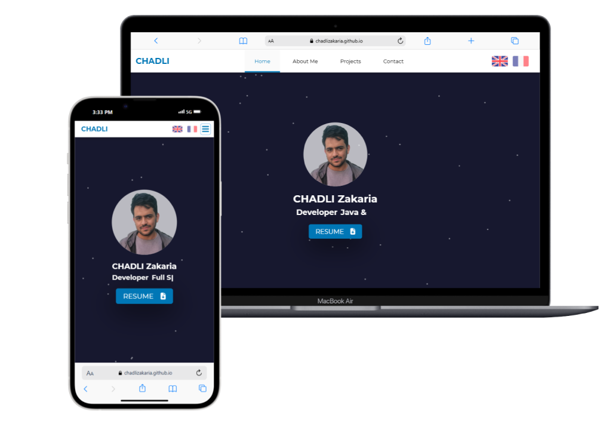

# Portfolio Website



## 🖥️ Project Overview
This is my personal **React.js** portfolio website designed to highlight my expertise and projects. The site is built using modern web technologies for a smooth and interactive user experience.

## 🔧 Technologies Used
- **Frontend**: React.js, TypeScript
- **Animations**: tsParticles (@tsparticles/slim)
- **Deployment**: GitHub Pages

## 🌟 Features
✅ **Fully responsive design** 📱💻  
✅ **Smooth animations and interactive UI** 🎨✨  
✅ **Projects showcase with detailed descriptions** 📂📝  
✅ **Contact form for easy communication** 📩✉️ 
✅ **Multi-language support** 🌍🈯  


## 🛠️ Installation & Setup
1. Clone the repository:
   ```sh
   git clone https://github.com/CHADLIZakaria/Portfolio.git
   ```
2. Navigate to the project folder:
   ```sh
   cd Portfolio
   ```
3. Install dependencies:
   ```sh
   npm install
   ```
4. Start the development server:
   ```sh
   npm start
   ```

## 📞 Contact
Feel free to reach out via [LinkedIn](https://www.linkedin.com/in/zakaria-chadli/) or [GitHub](https://github.com/CHADLIZakaria)!

---
**⭐ Show your support!**
If you like this project, don't forget to star ⭐ the repository!

